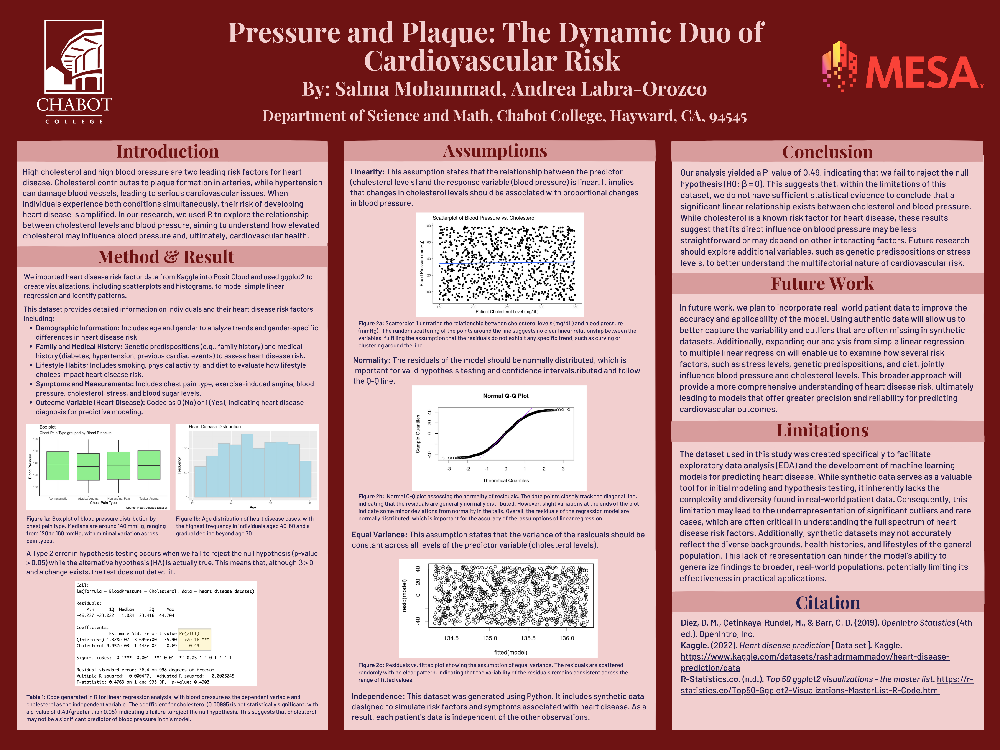

# 🫀 Heart Disease Risk: Exploring Cholesterol & Blood Pressure

This project explores the relationship between **cholesterol levels** and **blood pressure** using a synthetic heart disease dataset. We applied **simple linear regression** and data visualization techniques in R to test whether cholesterol is a significant predictor of blood pressure — a known risk factor for heart disease.

## 📊 Summary

- **Dataset**: Synthetic heart disease data from Kaggle, modeled after real-world risk factors  
- **Method**: Simple linear regression using R (ggplot2, readr, and base functions)  
- **Goal**: Determine if cholesterol levels can predict blood pressure values  
- **Outcome**: No statistically significant relationship found (p = 0.49)

## 🧪 Variables Explored

- **Demographics**: Age, gender  
- **Lifestyle Factors**: Smoking, physical activity  
- **Symptoms & History**: Chest pain type, angina, family history, diabetes  
- **Predictors/Outcome**:
  - Predictor: Cholesterol (mg/dL)
  - Outcome: Blood pressure (mmHg)
  - Outcome (for classification): Presence of heart disease (Yes/No)

## 📈 Analysis Highlights

- Used boxplots and scatterplots to visualize trends  
- Performed assumption checks for linearity, normality, equal variance, and independence  
- Linear regression output showed **no significant predictive relationship** (p > 0.05)

## 🔍 Key Takeaways

> While cholesterol is widely accepted as a risk factor, our model did **not** find it to be a significant standalone predictor of blood pressure. This may reflect limitations in the synthetic dataset or the need to consider additional variables like stress, genetics, and diet.

## 🔮 Future Work

We plan to:
- Expand the model using **multiple regression**
- Incorporate **real-world data**
- Explore **intersectional factors** like gender, ethnicity, and lifestyle

## 🧾 Citation

- Diez, D. M., Çetinkaya-Rundel, M., & Barr, C. D. (2019). *OpenIntro Statistics (4th ed.)*.  
- Kaggle (2022). [Heart Disease Dataset](https://www.kaggle.com/datasets/rashadmirzayev/heart-disease-prediction)  
- R-Statistics.co. [Top 50 ggplot2 visualizations](https://r-statistics.co/Top50-Ggplot2-Visualizations-MasterList-R-Code.html)

## 📌 Files in this Repo

- `heartdiseaseprediction.Rmd` – Main R Markdown analysis notebook  
- `heart_disease_dataset.csv` – Synthetic dataset used for modeling  
- `heartdiseaseposter.png` – Research poster summarizing the project  
- `README.md` – This file!
